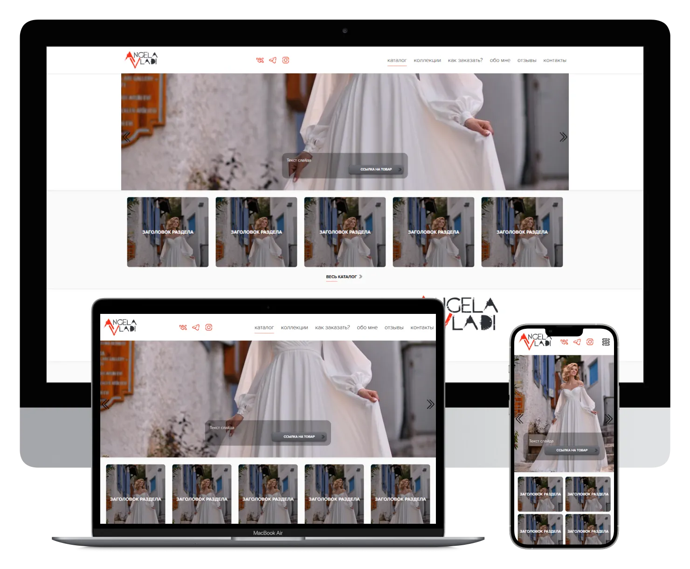

# AngelaVladi

[🇬🇧 English](#english) | [🇷🇺 Русский](#русский)

---

## English

### AngelaVladi

Project: http://angelavladi.yuriypvh.beget.tech/

Project on 1C-Bitrix

A design clothing catalog project without online shopping, but with order requests. A completely written design, project structure and the logic of the work.

---

### About the project

#### Functionality
- Swiper and Lightgallery libraries
- Adaptive photo resizing configured and assembled into a picture tag
- Feedback and review forms with saving to the admin panel
- Google ReCaptcha
- Yandex maps
- All data can be fully edited from the admin panel

#### Pages
- Home
- Catalog
- Collections
- How to Order
- About Us
- Reviews
- Contacts
- Detailed product pages

#### Not Implemented
- Custom property of type color (for products)

---

### License

This project is licensed under the [GNU Affero General Public License v3 (AGPLv3)](https://www.gnu.org/licenses/agpl-3.0.html).

---

### Contacts

Author: Yuriy Plotnikov  
Website: https://yuriyplotnikovv.ru  

---

## Русский

### AngelaVladi

Проект: http://angelavladi.yuriypvh.beget.tech/

Проект на 1C-Bitrix и PHP

Проект каталога дизайнерской одежды без онлайн покупок, но с оформлением заявок. Полностью с нуля написанный дизайн, структура и вся логика работы.

---

### О проекте

#### Функциональность
- Библиотеки Swiper и Lightgallery
- Настроен адаптивный ресайз фото и сборка в тег picture
- Формы обратной связи и отзывов с сохранением в админку
- ReCaptcha Google
- Карты Яндекс
- Полностью все данные редактируются из админки

#### Страницы
- Главная
- Каталог
- Коллекции
- Как заказать
- О нас
- Отзывы
- Контакты
- Детальные страницы товаров

#### Не реализовано
- Кастомное свойство типа цвет (для товаров)

---

### Лицензия

Проект распространяется под лицензией [GNU Affero General Public License v3 (AGPLv3)](https://www.gnu.org/licenses/agpl-3.0.html).

---

### Контакты

Автор: Yuriy Plotnikov  
Сайт: https://yuriyplotnikovv.ru  
